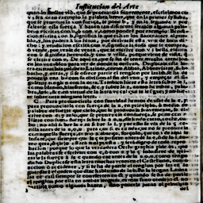
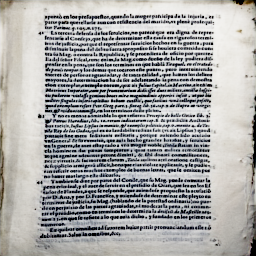
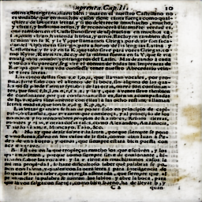
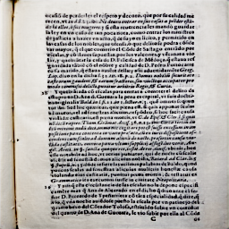
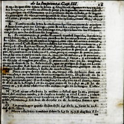
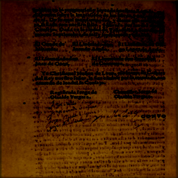

## Abstract

This project aims to generate *synthetic Renaissance-style* printed text images that authentically replicate the *visual characteristics* of *17th-century print media*. The objective is to simulate *realistic historical degradations* such as *ink bleed*, *smudging*, *fading*, and *printing inconsistencies*, enabling the creation of enriched datasets for training and evaluating *document restoration*, *OCR*, and *historical text analysis* models. By blending *historical aesthetics* with *modern generative techniques*, this work supports advancements in *digital humanities* and the preservation of *early modern printed culture*.

## 🔎Approach

### 1. Dataset Preparation
* PDF to Image Conversion: All available Renaissance PDFs are converted into high-resolution .jpg images using the pdf2image library. Each page is stored with a consistent naming scheme, enabling traceability between original documents and their image representations.
* Text Extraction from .docx: Transcriptions corresponding to the scanned documents are extracted from .docx files using the python-docx library. These serve as the semantic textual inputs for guiding image generation.
* Image Preprocessing: Each image is resized to a fixed resolution (256×256), normalized to the range [-1, 1], and converted to tensors. These transformations are necessary for consistent GAN training.

### 2. Text Embedding Using BERT
* Transcription texts are tokenized and embedded using the pretrained bert-base-uncased model from HuggingFace Transformers.
* The [CLS] token representation is averaged across sequence length to form a dense vector (768 dimensions), capturing semantic information of the input text.
* These embeddings are later spatially expanded and fused with visual data to condition the generation process.

### 3. GAN Architecture
This project uses a Generative Adversarial Network (GAN) architecture guided by BERT text embeddings to simulate Renaissance-style degradations on textual images. The architecture consists of:
#### Generator:
* Inputs: A real image and its corresponding BERT embedding.
* The BERT embedding is projected to a spatial map and concatenated as an additional channel to the image.
* The network contains multiple residual blocks, enabling it to learn complex transformations while preserving visual structure.
* Output: A synthetic version of the image with learned historical degradations (e.g., faded ink, smudges).
#### Discriminator:
* A convolutional classifier trained to distinguish between real Renaissance images and the generated ones.
* It guides the generator through adversarial training by penalizing unrealistic features.
#### Loss Functions: 
* Combines adversarial loss (real vs fake classification) with an L1 cycle-consistency loss to retain image structure while applying degradation.

### 4. Training Strategy
#### Loss Functions:
* Adversarial Loss (Binary Cross-Entropy): Ensures the generator produces realistic outputs that can fool the discriminator.
* Cycle-Consistency Loss (L1): Encourages the generator to preserve the structural fidelity of the input image.
* Optimization: Both networks are trained using the Adam optimizer with tuned learning rates and momentum parameters (betas).
#### Training Details:
* Trained for 150 epochs using batch size = 8.
* At each step, the generator and discriminator are updated in tandem.
* Intermediate results are saved at the end of each epoch.

### 5. Image Generation Pipeline
* Given a test image and optional transcription, the model generates a historically-degraded synthetic version.
* The generator runs in evaluation mode, and outputs are stored in a dedicated output directory for inspection.

### 6. Visual Degradation Simulation
The GAN implicitly learns to apply historical degradation effects such as:
* Ink bleeding and inconsistent printing
* Smudges and faded strokes
* Alignment noise and paper texture artifacts

These effects are learned directly from training data, avoiding the need for explicit rules or filters.

## ✔Evaluation Metrics 
To evaluate the performance of the GAN model in generating synthetic Renaissance-style printed text images, I employed a combination of pixel-level, structural, and perceptual metrics. Each of these offers unique insights into how well the generated images replicate the visual characteristics of historical print media.
### 1. Structural Similarity Index (SSIM)
SSIM is used to assess how well the generated images preserve the structural integrity of the original printed text. Since the goal is to simulate realistic degradations found in 17th-century documents—like smudging, ink bleed, and layout inconsistencies—SSIM helps evaluate whether the core structural details are maintained in the synthetic outputs. A higher SSIM score indicates that the generator has succeeded in producing images that are visually consistent with the original in terms of layout and texture.
### 2. Peak Signal-to-Noise Ratio (PSNR)
PSNR provides a quantitative measure of the pixel-wise fidelity between the generated and real images. While it doesn’t capture perceptual similarity, it is useful for tracking how accurately the GAN reconstructs fine details. In the context of this project, PSNR helps ensure that the generated degradations are not overly noisy or deviating drastically in pixel intensity from the original reference images.
### 3. Learned Perceptual Image Patch Similarity (LPIPS)
LPIPS is particularly important for this project, as it measures the perceptual similarity between generated and real images using deep neural network features. This metric aligns closely with human visual judgment, making it ideal for evaluating whether the GAN is producing stylistically convincing outputs that mirror the look and feel of old Renaissance prints. A lower LPIPS score indicates that the generated image is perceptually close to the original.

Together, these metrics provide a comprehensive evaluation pipeline—quantifying fidelity (PSNR), structural coherence (SSIM), and perceptual realism (LPIPS)—to ensure that the model’s outputs meet both visual and historical authenticity standards.

## 👀 Results Analysis

| Metrics  | Best Score   | Average Score |  Median Score|   Maximum Score|   Minimum Score| 
|---------|----------|---------|---------|---------|---------|  
|SSIM       |        0.871348     |       0.753159|       0.776838|     0.871348|     0.580901|
|PSNR      |      27.818388       |     27.393436|       27.386749|     27.818388|      26.969746|
|LPIPS            |      0.109699        |   0.260597|       0.252469|     0.467809|      0.109699|

## Evaluation Summary

### Structural Similarity Index (SSIM)
The highest SSIM score observed was 0.8713, indicating that some generated images closely resemble the structural composition of their real counterparts. On average, the SSIM score across the test set was 0.7531, with a median of 0.7768, suggesting consistent preservation of spatial and layout features across most images. Even the lowest score, 0.5809, reflects that the outputs retained a reasonable degree of structural coherence, despite intentional degradation patterns.

### Peak Signal-to-Noise Ratio (PSNR)
The PSNR values reflect pixel-level similarity. The best score achieved was 27.81 dB, with an average around 27.39 dB and a narrow range down to a minimum of 26.97 dB. These scores suggest that the generator successfully maintains pixel integrity and does not introduce excessive artifacts or noise. While PSNR is less sensitive to perceptual changes, these values indicate a generally clean reconstruction of visual details.

### Learned Perceptual Image Patch Similarity (LPIPS)
LPIPS provides a deep perceptual understanding of similarity, which is crucial for this project. The best (lowest) LPIPS score was 0.1097, indicating high perceptual similarity between generated and ground-truth images. The average LPIPS value across the dataset was 0.2605, with a median of 0.2524, and the worst case reached 0.4678. These results demonstrate that while some images varied more significantly in terms of perceptual realism, the overall generation quality closely aligns with the intended visual characteristics of early modern prints.

## Generated Images

